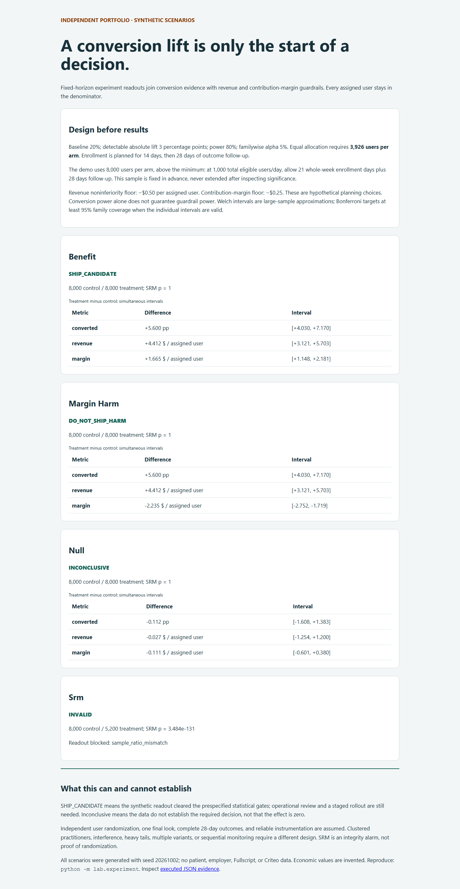
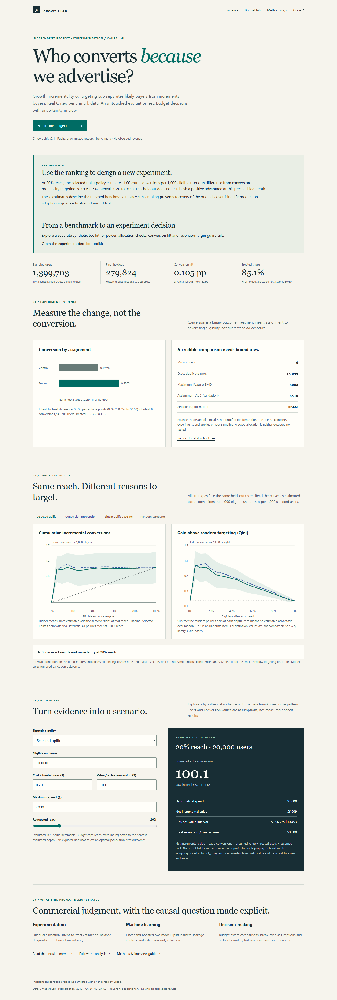
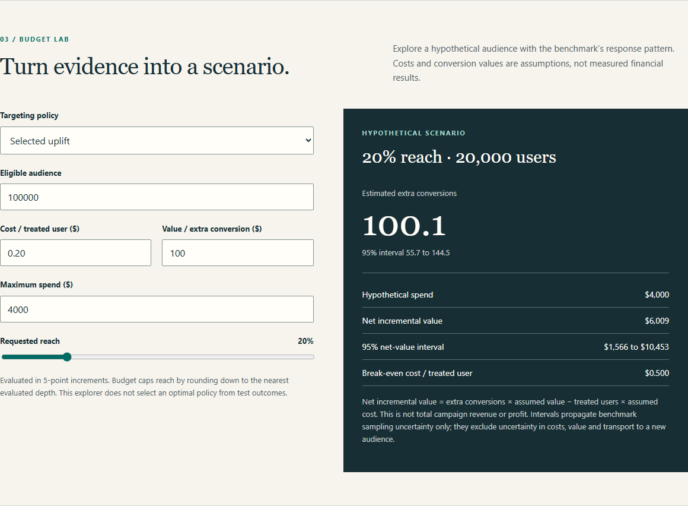
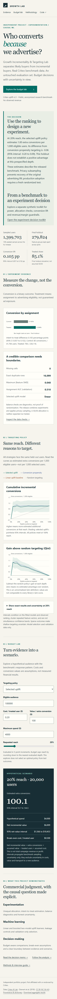

# Growth Incrementality & Targeting Lab

**Independent portfolio project · experimentation, causal inference and targeting decisions.**

## New: experiment decision toolkit

A separate **synthetic** extension turns experiment design into a revenue-aware decision: power planning, intention-to-treat readouts, sample-ratio and follow-up gates, simultaneous uncertainty, and revenue/contribution-margin noninferiority guardrails. Four runnable cases demonstrate a benefit, a conversion win with margin harm, an inconclusive null, and invalid allocation. It does not alter the Criteo results below.

Run `python -m lab.experiment`, then open [`outputs/experiment/index.html`](outputs/experiment/index.html). See the [five-minute walkthrough and interview questions](docs/experiment-toolkit.md) and [executed aggregate evidence](outputs/experiment/results.json). Tests and browser review run in CI.



Which users should receive advertising because it changes their likelihood of converting, and how does the decision change with a budget? This project complements descriptive payments analytics with intervention evaluation. It uses the official Criteo uplift v2.1 dataset, a reproducible sample, linear and boosted T-learners, and a static decision tool. No paid API or backend is required.

## Actual findings

The pipeline acquired and checksum-verified all **13,979,592** source rows, sampled **1,399,703**, trained on **840,310**, selected on **279,569**, and evaluated on **279,824** held-out rows. Identical covariate groups never cross partitions.

- **Overall benchmark effect:** +0.105 percentage points in conversion (95% CI 0.057–0.152), comparing advertising assignment with control on the final holdout.
- **Validation selected the linear T-learner**, ahead of two histogram-boosted candidates. The nonlinear approach did not justify replacing the baseline.
- At **20% reach**, selected uplift estimates **1.001** additional conversions per 1,000 eligible users (95% CI 0.557–1.445); propensity estimates **1.056** (0.599–1.513); random estimates **0.209** (0.115–0.304).
- The paired uplift-minus-propensity difference is **−0.055** per 1,000 (95% CI −0.199–0.088). **This evaluation does not establish uplift superiority over propensity.** Uplift-minus-random is +0.792 (0.435–1.149).

Recommendation: compare uplift and propensity policies in a new randomized experiment at equal reach. Do not treat privacy-altered benchmark results as a production revenue estimate or a deployed targeting win.

## Preview

Open [`outputs/site/index.html`](outputs/site/index.html) directly, or serve it locally as below. All data and scripts are local; relative links also work under a GitHub Pages project path. No live deployment is claimed unless verified in the delivery status.





<details><summary>Mobile screenshot</summary>



</details>

## Setup and execution

Python **3.12** is the tested runtime. Create a virtual environment, activate it, then install the exact environment lock:

```bash
python -m venv .venv
# Windows PowerShell: .venv\Scripts\Activate.ps1
# macOS/Linux: source .venv/bin/activate
python -m pip install -r requirements.lock
```

`requirements.txt` lists direct analysis/build dependencies; `requirements.lock` pins the executed environment including browser-test packages. The initial download is 311 MB compressed. Allow roughly 1–2 GB for data, caches, Python dependencies and optional browser binaries; training uses additional memory. Keep at least 4 GB RAM free. Local measured pipeline time after acquisition was about 20 seconds on this workstation with the sample cached; it is not a cross-machine performance guarantee.

Full portfolio analysis (10% of the complete official source, not a prefix):

```bash
python -m lab.acquire
python -m lab.pipeline
python scripts/validate_outputs.py
python scripts/build_site.py
python -m http.server 8000 --directory outputs/site
```

Visit `http://localhost:8000`. `lab.pipeline` samples across all 13.98 million rows, fits three uplift candidates, freezes validation selection, evaluates four policies, and writes aggregate results. Model training uses the 10% sample, not all source rows. The raw download is verified on every run. Seed **20260923** controls inclusion, grouping and model randomness; output metadata stores source and sample hashes.

Fast real-data smoke mode:

```bash
python -m lab.pipeline --smoke
```

Smoke uses 0.4% of the source (55,696 rows in this run), fewer boosting iterations and separate output/prediction files. The first smoke run scans the full compressed file, then reuses its verified cache. It completed in about 16 seconds after acquisition here. Smoke findings are not the portfolio findings. There is no silent synthetic fallback; failed acquisition raises an error. Synthetic data exists only inside tests, explicitly labeled as fixtures.

## Validation

```bash
python -m pytest -q
python scripts/validate_outputs.py
python scripts/build_site.py
python -m playwright install chromium
python scripts/browser_check.py
```

- Estimator tests cover unequal assignment, known randomized effects, zero/full/random policy identities, clustered standard errors, stable ranking and input rejection.
- Pipeline tests cover strict feature exclusion, duplicate-group split isolation, deterministic partitions, train/validate/predict integration and committed output integrity.
- Build tests resolve all internal links/anchors and ensure empirical data powers the static site.
- Independent DuckDB calculations reconcile the overall contrast and 0/5/20/50/100% policy estimates against local held-out prediction rows.
- Browser tests reconcile 20 simulator scenarios against Python arithmetic, check budget boundaries, zero cost, invalid inputs, keyboard changes, seven pages at desktop/mobile widths and JavaScript exceptions.

See [`outputs/analysis/validation.json`](outputs/analysis/validation.json) and [`outputs/analysis/browser-validation.json`](outputs/analysis/browser-validation.json) for executed receipts. CI runs tests, static build and browser checks without downloading raw data. It uses committed aggregates for presentation tests and explicit synthetic fixtures for unit/integration tests; it does not claim to rerun the empirical analysis.

Optional one-page PDF rebuild:

```bash
pip install -r requirements-pdf.txt
python scripts/make_memo_pdf.py
```

The supplied PDF was rendered and visually reviewed. The builder asserts one page. For review, use `pdftoppm -png -singlefile outputs/reports/decision-memo.pdf work/memo` if Poppler is installed.

## Architecture

```text
Official Criteo v2.1 CSV.gz (ignored raw data; SHA-256 verified)
  -> uniform-probability seeded sample + SQL/Python audit
  -> feature-group split: training / validation / final holdout
  -> logistic T-learner + two histogram-boosted T-learners
  -> validation AUQC selection saved before final evaluation
  -> allocation-adjusted policy values + clustered uncertainty
  -> aggregate JSON -> portable static site + generated reports
```

| Location | Purpose |
|---|---|
| `lab/acquire.py` | Official acquisition and checksum gate |
| `lab/pipeline.py` | Sampling, quality checks, partitions, models and selection |
| `lab/estimators.py` | Policy contrasts, Qini and clustered influence-function intervals |
| `sql/audit.sql` | Arm-level audit |
| `site/` | Authored HTML, CSS, accessible SVG charts and scenario calculator |
| `scripts/` | Static build, independent reconciliation, browser QA and PDF memo |
| `tests/` | Estimator, leakage, pipeline and static-build tests |
| `docs/` | Methodology, provenance/dictionary and interview guide |
| `outputs/analysis/` | Aggregate results, model selection and validation receipts |
| `outputs/reports/` | Decision memo, analysis walkthrough and resume bullets |
| `.github/workflows/` | CI and Pages deployment |

The site contains no individual records, model-serving endpoint, analytics trackers, cookies or secrets. Raw data, sampled data, held-out predictions, split membership, local environments and intermediate files are ignored by Git. Aggregate results are intentionally versioned so Pages builds do not need source-data downloads.

## Metric definitions and limitations

Treatment means advertising **assignment**, not exposure. Conversion is the binary released outcome. At reach q, the policy value is `sum(T*pi*Y)/n1 - sum((1-T)*pi*Y)/n0`; it adjusts for the approximately 85/15 allocation and uses the whole eligible audience as denominator. Qini subtracts `q * full-reach effect`. AUQC integrates this unnormalized Qini curve. Random targeting uses its expected stochastic value.

95% intervals use feature-group clustered influence functions. Paired policy differences retain covariance. They are pointwise, conditional on fitted models and observed ranking, and exclude training/selection uncertainty, unknown advertiser clusters, future threshold variation and transport. Only 80 final-holdout control conversions make precision a material concern. The 20% comparison is prespecified; other depths are exploratory. No final-test optimum is selected.

Criteo nonuniformly subsampled for privacy and projected/anonymized covariates. Its first-release advertiser leak was addressed in the revised release, but unknown selection remains. Original assignment probabilities, experiment IDs, user IDs, timestamps and revenue are unavailable. A marginal allocation adjustment cannot recover the original advertising effect. Small measured imbalance (maximum absolute SMD 0.048; assignment AUC 0.510) does not prove identification. Repeated rows may be distinct anonymized users; retain them, isolate feature groups and cluster uncertainty.

The simulator's cost per treated user and value per incremental conversion are hypothetical. A 100,000-user scenario at 20% uplift reach, $0.20 cost and $100 value produces about 100.1 extra conversions, $4,000 spend and $6,009 net incremental value (sampling interval $1,566–$10,453). This is not observed revenue or profit. Budget caps round down to the 5-percentage-point evaluated grid.

## Deliverables

- [Executive portfolio](outputs/site/index.html)
- [Methodology](docs/methodology.md) and [data provenance/dictionary](docs/provenance.md)
- [Executed analysis walkthrough](outputs/reports/walkthrough.md)
- [One-page decision memo PDF](outputs/reports/decision-memo.pdf) and [Markdown](outputs/reports/decision-memo.md)
- [Interview guide](docs/interview-guide.md)
- [Three defensible resume bullets](outputs/reports/resume-bullets.md)

## GitHub Pages setup

The intended repository is `IamGRootMSE/growth-incrementality-lab`; the project branch is `project/growth-incrementality-lab`. See `outputs/reports/delivery-status.md` for the actual commit/push/deployment status; configured workflows are not evidence of a successful deployment.

After the branch is pushed, enable **Settings → Pages → Build and deployment → Source: GitHub Actions**. The Pages workflow runs on `main` pushes or a manual workflow dispatch. Merge the reviewed project branch into `main` (or dispatch from a branch allowed by the `github-pages` environment). Ensure Actions is enabled and the environment permits deployment from that ref. A workflow success and an HTTP check of its reported URL are required before claiming the site is live. Never force-push or overwrite an existing default branch.

## Source and license

[Official dataset page](https://ailab.criteo.com/criteo-uplift-prediction-dataset/) · [Official Criteo dataset repository](https://huggingface.co/datasets/criteo/criteo-uplift) · [Diemert et al. (2018)](https://openreview.net/pdf?id=Q83-QeTB9lS).

Dataset and data-derived aggregates/reports: **CC BY-NC-SA 4.0**, with attribution and modifications disclosed. Original software: **MIT**. See [LICENSE](LICENSE) and [provenance](docs/provenance.md). This independent project is not affiliated with or endorsed by Criteo.
